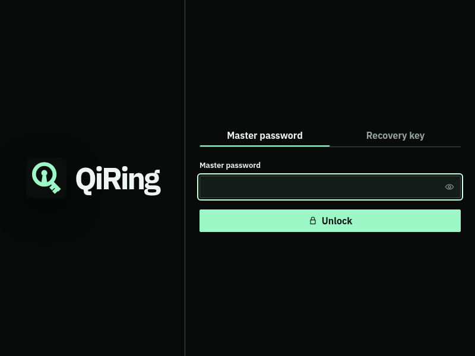
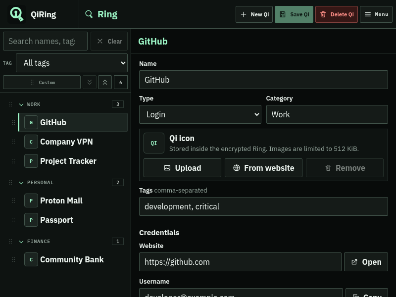

# QiRing

QiRing is a security-first, local-only desktop password manager for Linux, macOS, and Windows. It is built with Tauri 2, Rust, and a minimal Vite frontend.

> **Project status:** QiRing `0.1.1` is pre-release software. Keep independent backups and do not use it as the only copy of important credentials.

| Lock screen | Ring with example Qi entries |
| --- | --- |
|  |  |

_Screenshots use fictional example data and the minimum `800 x 600` viewport._

## Features

- Login entries and secure notes organized as categorized, searchable Qi entries
- Tags, custom fields, security questions, password history, and TOTP codes
- Configurable password profiles and an offline password-health report
- Master-password unlock, recovery-key rotation, auto-lock, and timed clipboard clearing
- Encrypted manual backups and automatic snapshots
- Validated CSV import and warned plaintext CSV export for migration or cold storage
- Normal installation and explicit portable modes for AppImage and standalone Windows builds

## Security model

- Ring data is encrypted locally; QiRing has no account, cloud-sync backend, or telemetry.
- Argon2id derives the password key-encryption key, and XChaCha20-Poly1305 protects vault data.
- Vault writes are atomic, sensitive key material is zeroized where practical, and logs exclude secrets.
- Network access occurs only for user-requested URL opening and direct favicon retrieval. Favicon retrieval is optional and does not use a third-party service.

Read the [threat model](docs/threat-model.md) for trust boundaries, implemented controls, and residual risks.

## Quick start

Install [Rust with rustup](https://www.rust-lang.org/tools/install), Node.js 24 LTS, npm, and the [Tauri prerequisites](https://v2.tauri.app/start/prerequisites/) for your operating system. Then run:

```bash
npm --prefix apps/desktop ci
cd apps/desktop
npm run tauri -- dev
```

Linux development hosts can instead use the repository launcher, which includes WebKitGTK rendering safeguards:

```bash
./scripts/run-desktop.sh
```

See the [development and build guide](docs/development.md) for platform setup, validation, bundle commands, artifact locations, portable mode, and troubleshooting.

## Build targets

| Platform | Installer | Portable release |
| --- | --- | --- |
| Linux | AppImage and DEB | AppImage plus marker in `.tar.gz` |
| macOS | DMG | Not supported |
| Windows | MSI | Standalone executable plus marker in `.zip` |

Native bundles must be built on their corresponding operating system. GitHub Actions verifies the workspace and builds the complete release matrix.

## Documentation

- [User guide](docs/user-guide.md)
- [Development, builds, storage, and portable mode](docs/development.md)
- [Release process and signing](docs/release-process.md)
- [Threat model](docs/threat-model.md)
- [Future work](docs/future-work.md)
- [Parser fuzzing](fuzz/README.md)

## Workspace

- `apps/desktop`: Tauri shell and web interface
- `crates/qiring-core`: vault domain logic and policies
- `crates/qiring-crypto`: cryptography and key hierarchy
- `crates/qiring-storage`: encrypted persistence

## License

QiRing is licensed under [AGPL-3.0](LICENSE).
