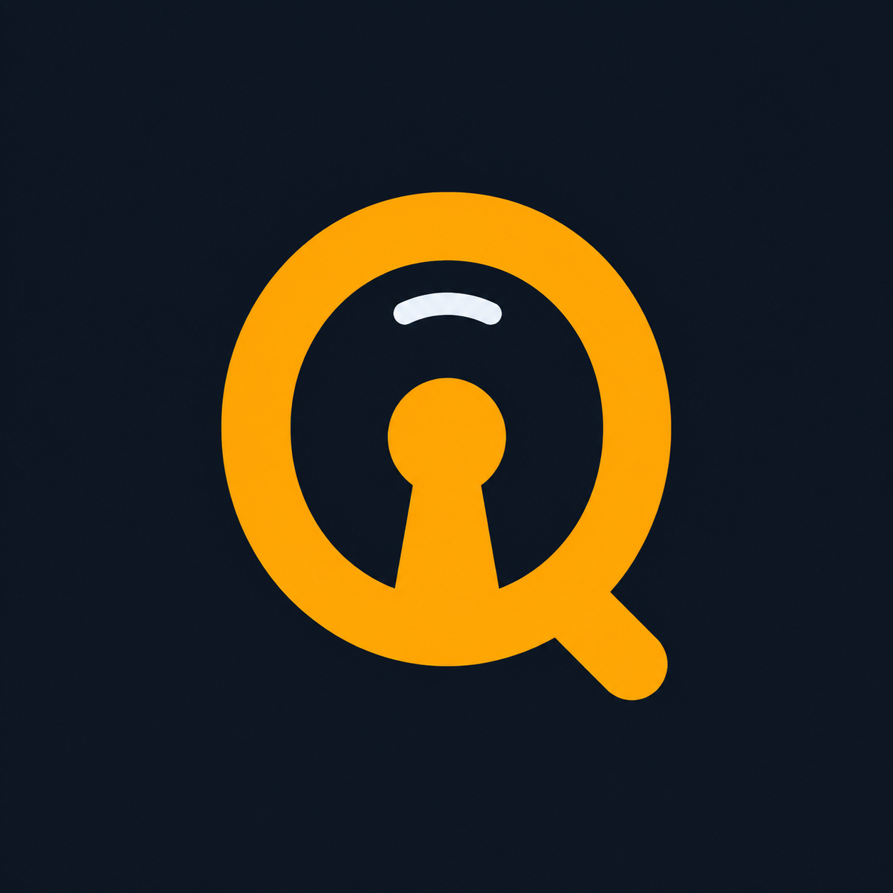
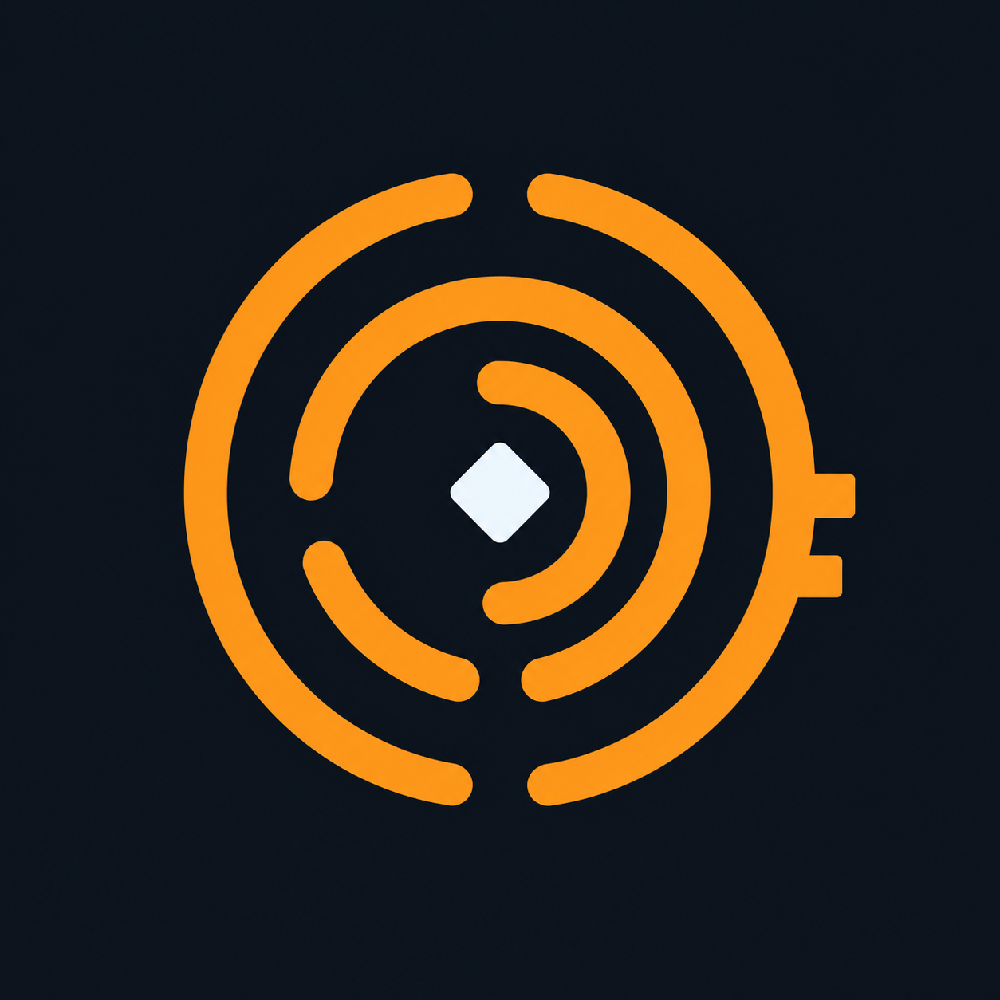

# QiRing Logo Concepts

These are the three exploratory raster concepts generated for the assessment. Concept 1 was selected and redrawn as a deterministic SVG using QiRing's production mint/slate palette.

## Concept 1 — Q Keyhole

A direct, legible app icon: one amber ring forms a Q silhouette around a keyhole. This is the clearest security association and should survive small sizes well, but it is the most literal of the three.

**Generation prompt:** Square desktop application icon for QiRing. A distinctive minimal mark built from one continuous amber ring that also forms a subtle keyhole and the tail of a capital Q; communicate protected credentials, continuity, and a ring of keys. Deep slate navy background, warm amber and cool-white accent, centered flat vector-style geometry, no text, no watermark, no mockup, no fragile lines.

## Concept 2 — Interlocking Rings

Two offset loops create a key through negative space. This emphasizes the “ring of keys” idea and feels more like a broader identity system than a conventional password-manager icon.

**Generation prompt:** Square desktop application icon for QiRing. Two offset geometric loops woven together, one suggesting a key ring and the negative space suggesting a protected key; modern security tool without a literal lock or shield. Deep slate navy background, amber and muted ice blue, compact Bauhaus geometry, no words, no watermark, no mockup, no thin lines.

## Concept 3 — Qi Rings

Concentric broken arcs orbit a protected center while the outer break becomes a key tooth. This is the most abstract and ownable direction, linking the “Qi” energy idea to a ring and a key.

**Generation prompt:** Square desktop application icon for QiRing. Three sturdy concentric broken arcs rotate around a small central diamond, with one break subtly resembling a key tooth; communicate calm control, local protection, and organized credentials without a literal lock. Deep slate navy background, warm amber arcs and pale center, thick flat vector-style lines, no text, no watermark, no mockup.

## Recommendation (superseded — see 2026-08-09 round below)

Concept 1 was the first adopted application mark, replaced by Concept 1C on 2026-08-09. Concepts 2 and 3 remain exploration only.

**Generation method:** OpenAI built-in image generation tool.  
**Files:** 1254 x 1254 PNG, RGB.

## 2026-08-09 round

Four new SVG options, drawn directly (not raster-generated) at the same 128×128 canvas and mint/slate palette as the original production mark.

### Concept 1B — Q keyhole with vintage key teeth

A direct evolution of Concept 1, per specific feedback: keep the keyhole inside the Q's ring, but update the Q's tail into a vintage skeleton-key shaft with stepped bit teeth cut into it — the kind of asymmetric notch profile an old lock's wards would require. The ring is unchanged from Concept 1 so the keyhole reading stays intact; only the tail changed from a plain diagonal stroke to a filled key-shaft-and-teeth silhouette. Holds up well at both large and small (favicon/taskbar) sizes.

### Concept 1C — Q keyhole with vintage key teeth (superseded)

Same ring, keyhole, and key-tail-with-teeth geometry as 1B, with one deliberate change: the small decorative highlight arc above the keyhole (present in Concept 1 and 1B) was removed for a cleaner, simpler silhouette that holds up better at very small sizes. Adopted briefly, then replaced by 1D below.

### Concept 1D — Q keyhole with vintage key teeth (superseded)

Same geometry as 1C, refined: the whole ring-and-key mark is scaled down and repositioned slightly within the canvas, giving more margin from the rounded-square edges at both large and small sizes. Adopted briefly, then replaced by 1E below.

### Concept 1E — Q keyhole with vintage key teeth (adopted)

**This is now the adopted application mark.** Same geometry as 1D, scaled back up (~25% larger) so the mark fills more of the canvas — bolder and more confident at both large and small (favicon/taskbar) sizes than 1D's smaller margin. The production source is [`qiring-concept-1e-key-teeth.svg`](./qiring-concept-1e-key-teeth.svg); the same geometry is bundled in the frontend at `apps/desktop/src/assets/qiring-mark.svg`, and the complete Tauri desktop/mobile icon set was regenerated from it.

### Concept 4 — Keyring

Three overlapping rings of different sizes and weights, evoking a physical keyring holding several keys — a more literal take on "QiRing" than the original two-ring concept from the first round. A keyhole is still cut into the largest ring to keep a security cue present. Reads clearly at icon size; the keyhole cutout becomes subtle at favicon size (16-24px), so it would need a simplified small-size variant if pursued.

### Concept 5 — Qi signet

The most abstract option: a round seal/signet with a flowing spiral line through the center suggesting "Qi" energy and continuity, grounded by a small solid point rather than a literal keyhole. Least literal about security or locks; leans on the "Qi" half of the name instead of the "Ring" half. Holds up best of the four new options at very small sizes because the spiral stays legible as a single continuous shape even when detail is lost.

### Concept 6 — Vintage warded key

The most literal vintage-lock treatment: a full antique key silhouette, bow drawn as a round Q-style ring with an inner cut (echoing an old escutcheon plate), long shaft, and an asymmetric stepped warded bit at the tip — the classic "skeleton key" silhouette the feedback referenced. No keyhole shape this time; the security cue comes entirely from the key form itself. Strongest vintage/antique character of the four, but the bit detail is the first thing to lose legibility at favicon size, leaving mainly a round-bow-with-shaft silhouette.

**Generation method:** Hand-authored SVG (no raster generation step this round).  
**Files:** 128×128 viewBox SVG, matching the production mark's palette (`#0a0e0d` background, `#9df7c7`/`#55c98d` accent greens, `#eef6f1` highlight).

## Known limitation: taskbar icon under `cargo run` on Wayland

The regenerated icon set is correct and used by real Tauri bundles (`.deb`/AppImage from `npm run tauri -- build`), which install a `.desktop` entry and an icon-theme icon that the OS looks up by application ID. Running the app directly with `./scripts/run-desktop.sh` or `cargo run` skips that install step entirely — no `.desktop` file, nothing in `~/.local/share/icons/`. On Wayland (GNOME, KDE), the compositor resolves a window's taskbar/panel icon from that installed desktop-entry, not from anything the running process can set at the window level, so a `cargo run` session falls back to a generic icon there. X11 sessions typically show the correct icon during dev because X11 can take it directly from the window's own icon hint. This is a known gap in local dev tooling, not a bug in the shipped icon; a real install (or a manual one-time `.desktop` + icon-theme install matching identifier `dev.qiring.desktop`) resolves it.
